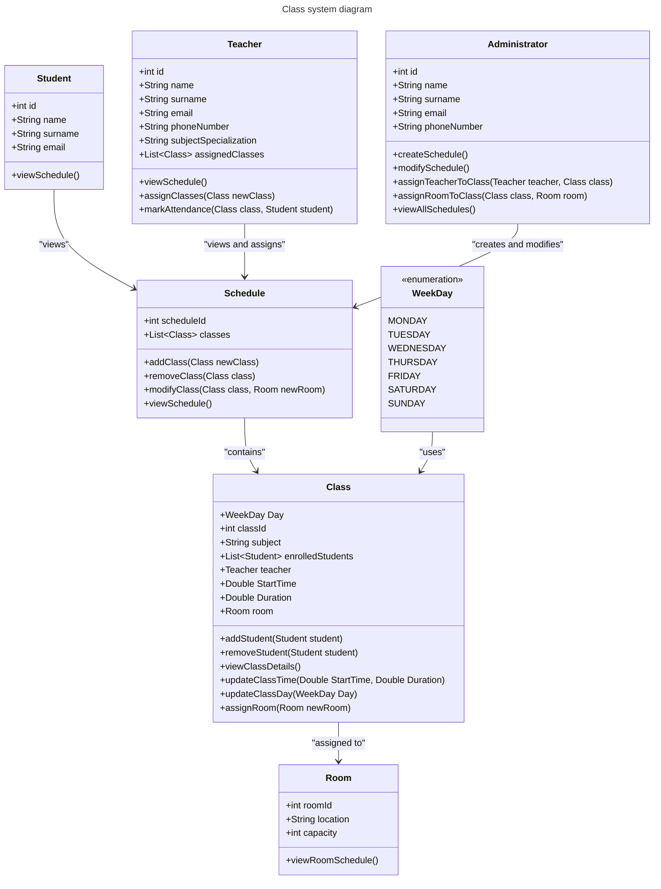
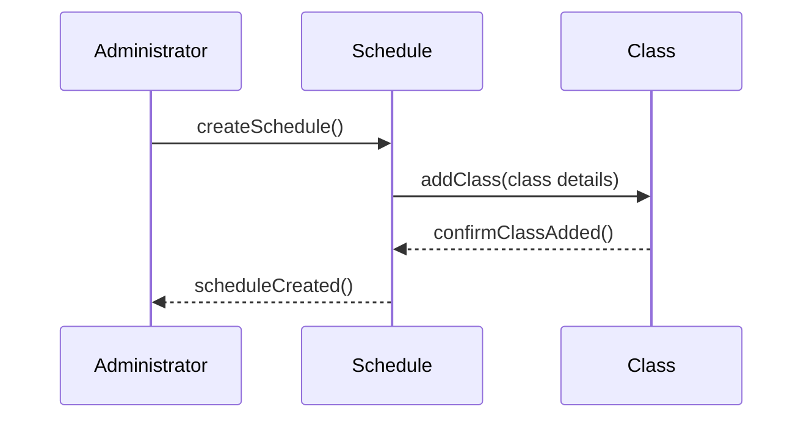

# PlanZajecUML

W systemie znajdują się następujące typy kont:

- `Teacher`
- `Student`
- `Administrator`

Każde konto ma różne poziomy uprawnień.

`Student` odpowiadający uczniom o najbardziej ograniczonym dostępie może tylko i wyłącznie obejrzeć już utworzony i zaakceptowany plan zajęć. 

`Teacher` odpowiadający wykładowcom poza oczywistym obejrzeniem planu zajęć ma możliwość dodania pod siebie nowej klasy oraz zaznaczania obecności uczniów. 

`Administrator` całego systemu posiada nieograniczone możliwości w edycji, aktualizacji i usuwaniu planu oraz przynależności wykładowców do danych zajęć. 

Za to klasy odpowiadające wykładowi - `Class` , sali wykładowej - `Room` oraz planu zajęć - `Shedule` posiadają również niezbędne elementy funkcyjne. 

`Room` zawiera informacje o pojemności i lokalizacji sali oraz moze wyświetlić indywidualny plan jakie zajęcie się w niej odbywają. 

`Class` zawiera między innymi informacje o czasie trwania zajęć i miejscu, dniu w którym one się odbywają przy pomocy enumeratora `WeekDay` oraz listę studentów uczeszczających na zajęcia i wykładowcę prowadzącego te zajęcia. Daje ona możliwość zmiany terminu odbywania się zajęć i miejsca , aktualizację aktywnych studentów oraz wyświetlenia szczegółowych danych o zajęciach.

<>...>

Made by:
Łukasz Stajkowski, Mateusz Bryniak
