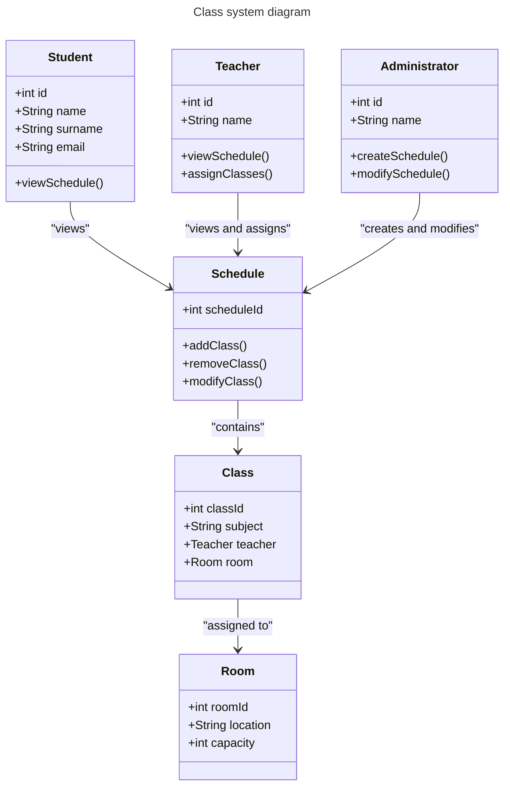
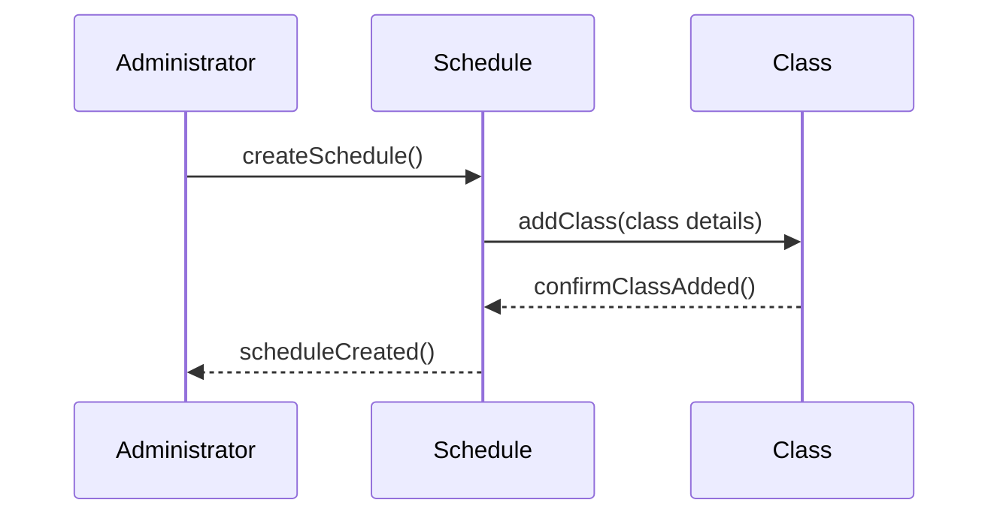

# PlanZajecUML
Uni project for pcz 

```mermaid
---
title: Class system diagram
---
classDiagram
    class Student {
        +int id
        +String name
        +String surname
        +String email
        +viewSchedule()
    }

    class Teacher {
        +int id
        +String name
        +viewSchedule()
        +assignClasses()
    }

    class Administrator {
        +int id
        +String name
        +createSchedule()
        +modifySchedule()
    }

    class Schedule {
        +int scheduleId
        +addClass()
        +removeClass()
        +modifyClass()
    }

    class Class {
        +int classId
        +String subject
        +Teacher teacher
        +Room room
    }

    class Room {
        +int roomId
        +String location
        +int capacity
    }

    Student --> Schedule : "views"
    Teacher --> Schedule : "views and assigns"
    Administrator --> Schedule : "creates and modifies"
    Schedule --> Class : "contains"
    Class --> Room : "assigned to"
```

```mermaid
sequenceDiagram
    participant Admin as Administrator
    participant Sched as Schedule
    participant Cls as Class

    Admin->>Sched: createSchedule()
    Sched->>Cls: addClass(class details)
    Cls-->>Sched: confirmClassAdded()
    Sched-->>Admin: scheduleCreated()
```

