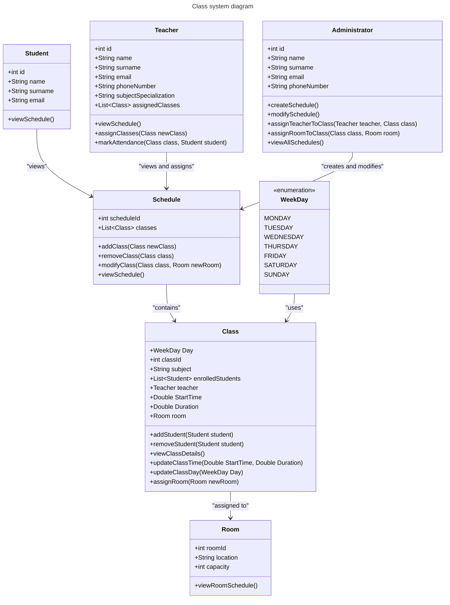
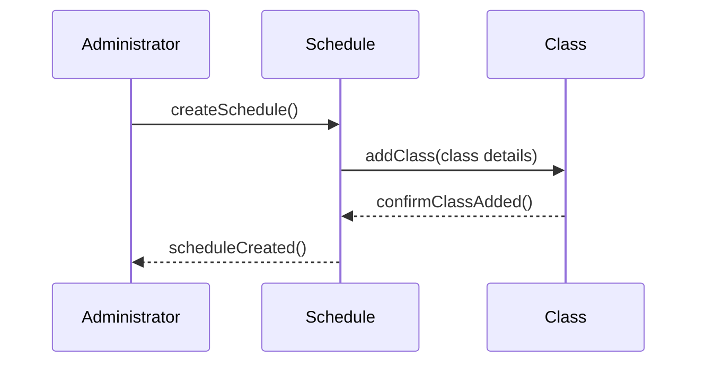

# PlanZajecUML

Uni project for pcz



note: W systemie znajdują się następujące typu kont: Teacher , Student , Administrator o różnych poziomach uprawnień. Student odpowiadający uczniom o najbardziej ograniczonym dostępie może tylko i wyłącznie obejrzec już utworzony i zaakceptowany plan zajęć. Teacher odpowiadający wykładowcom poza oczywistym obejrzeniem planu zajęć ma możliwość dodania pod siebie nowej klasy oraz zaznaczania obecności uczniów. 




tutaj pokaż przykład zastosowań jeśli chcesz dodać jakieś jeszcze by lepiej pokazać użycie tego "systemu" napisz klazule 
```
'''mermaid
<opis co ma być wykonane>
'''
```

Made by:
Łukasz Stajkowski
